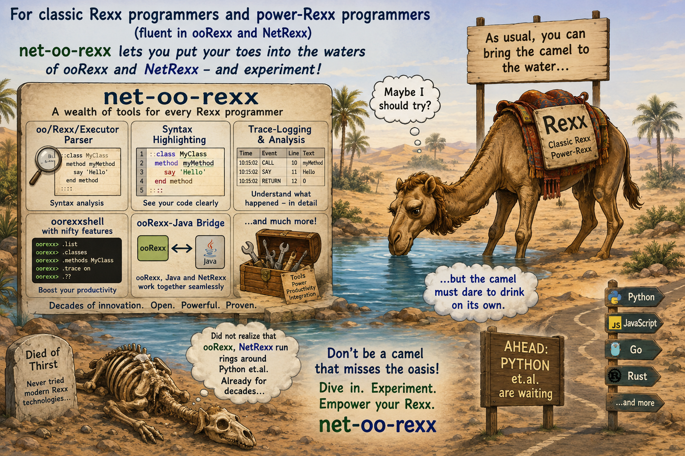

# net-oo-rexx

The repository for the net-oo-rexx package (since 2026-04)

## What is net-oo-rexx ?

net-oo-rexx is a "portable package" that can be carried along on a USB stick. It contains ooRexx, NetRexx, and many useful utilities and libraries for Windows, macOS, and Linux, ready to run.
Since ooRexx 5.0, it is possible to use different versions of ooRexx at the same time, such that you can use the net-oo-rexx version (usually the latest stable beta) in parallel on the same computer.
The net-oo-rexx package comes with the following interesting goodies:

- NetRexx with full documentation  and samples
- the latest stable ooRexx beta (e.g., ooRexx 5.3 beta) with full documentation and samples
- ooRexx related usability packages
  - `oorexxshell`, [ooRexxShell (three tutorials)](https://jlfaucher.github.io/executor.master/demos/index.html): a powerful, nifty, ooRexx-aware command line shell, boosting productivity on the command line, will load all net-oo-rexx packages
  - `rexxdebugger` - [A GUI Rexx debugger]( https://www.rexxla.org/presentations/2025/Rexx%20Debugger%20Presentation%20v2.pdf) (`rexxdebugger myRexxProgram.rex`, or `rexxdebugger tutorial.rex`)
  - [rexx-parser with many accompanying utilities like syntax highlighting of your Rexx programs](https://rexx.epbcn.com/rexx-parser/) (`rexx highlight –a myRexxProgram.rex`)
  - `tracetool.rex` [The Rexx TraceTool](https://www.rexxla.org/presentations/2025/2025_05_TraceTool.pdf) `rexx tracetool –tr myRexxProgram.rex`, e.g. followed by `rexx tracetool –s myRexxProgram.rex_trace.xml` (show tracelog), or `rexx tracetool –s myRexxProgram.rex_trace.xml` (create profile report from tracelog)
  - [Full ooRexx test suite; help sought for completing documentation, see included tests](https://www.oorexx.org/docs/pdf/ootest.pdf)
  - [The Unicode Tools Of Rexx (TUTOR)](https://rexx.epbcn.com/TUTOR/)
  - [BSF4ooRexx - the ooRexx-Java bridge](https://www.rexxla.org/presentations/2025/202505-03_IntroductionToBSF4ooRexx850_Tutorial.pdf)
    - `jdorfx`, see [JDORFX: Providing 3-D Graphics to ooRexx](https://www.rexxla.org/presentations/2025/2025-05-07_Jdorfx.pdf)
  - `regex`:  Rick McGuire's regular expressions (from his sandbox), used by `oorexxshell`
  - `log4rexx` [log4rexx - A log4j-Comparable Logging Framework for ooRexx Applications](https://www.rexxla.org/presentations/2007/ronyf2.pdf); see also [article](https://www.rexxla.org/presentations/2007/log4rexx_20070521.zip)
  - `dbus4oorexx` [The ooRexx DBus Bindings for Linux, MacOSX and Windows]( https://www.rexxla.org/presentations/2016/201608-dbusoorexx.pdf)

Many tools give a brief synopsis about what they do and what arguments they understand if you just enter the name of the tool, e.g., `rexx tracetool.rex`

## Where to download?

Notes:

- After downloading the Windows net-oo-rexx zip archive, run the following command before unzipping to allow all programs to run on Windows: `powershell unblock-file *`
- After downloading the macOS net-oo-rexx zip archive, run the following command before unzipping to allow all programs to run on macOS: `xattr -d com.apple.quarantine *`

To download click on the [Releases](https://github.com/RexxLA/net-oo-rexx/releases) section on the right-hand side.

## Cartoon

<!--
 
-->

